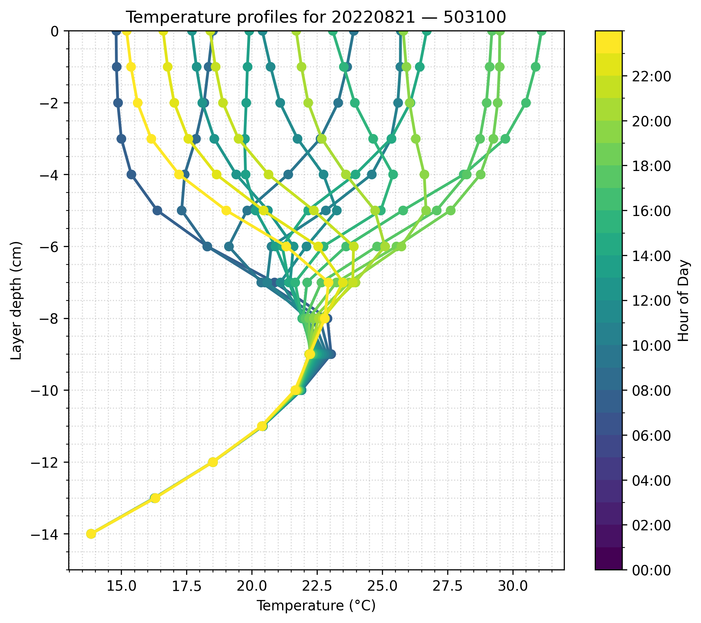
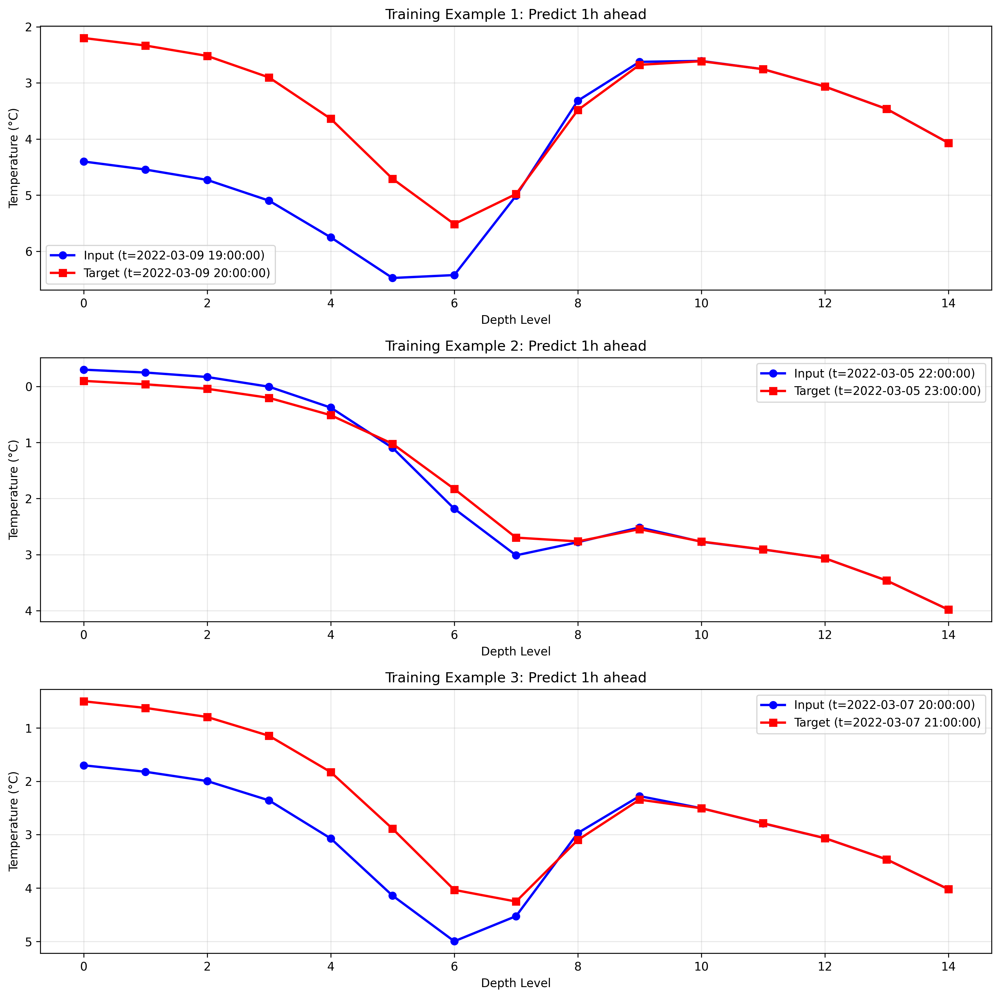
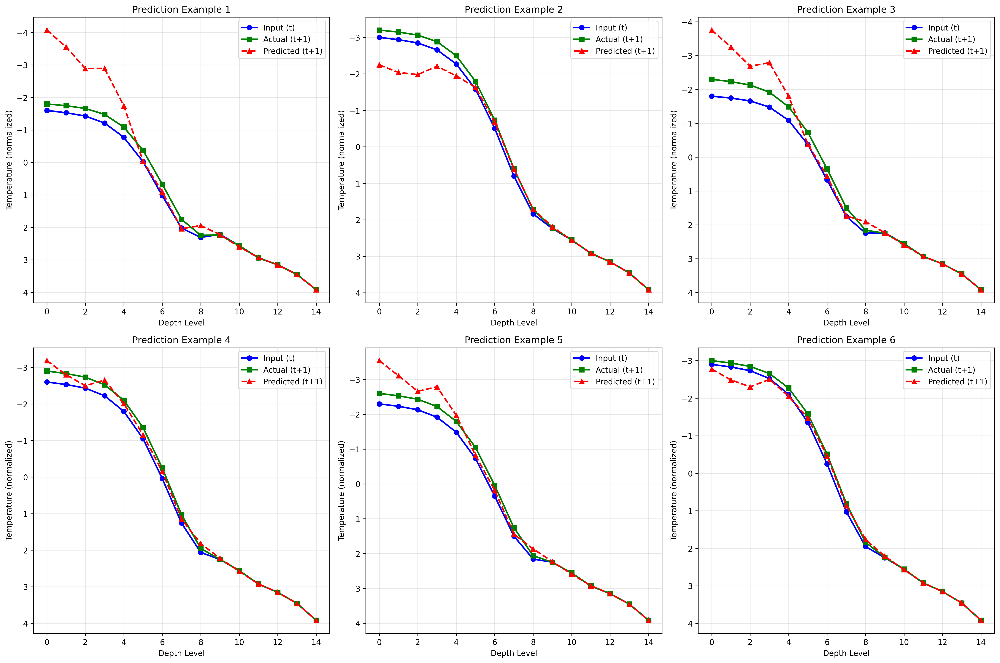

# Implement load_dataset in the dataset.Dataset
# Run `python train.py {path_to_dataset}`

### Testing adding real profiles
The data is in the path `/data/projects/glatmodel/obs/fild8/road_profiles_daily`, where
each parquet files contains all the profiles for all stations for each day.
There are 24 profiles per station, stored with the structure shown below.


```

>>> import pandas as pd
>>> df=pd.read_parquet("road_temp_20220822.parquet")
>>> df
                  timestamp  station_id  depth_0  depth_1  depth_2  depth_3  ...  depth_9  depth_10  depth_11  depth_12  depth_13  depth_14
0       2022-08-22 00:00:00  0-100000-0   290.15  290.269  290.454  290.853  ...  296.229   295.226   293.909   291.946   289.626    286.99
1       2022-08-22 00:00:00  0-100001-0   289.35  289.499  289.730  290.229  ...  296.920   295.762   294.318   292.179   289.715    286.99
2       2022-08-22 00:00:00  0-100100-0   291.85  292.016  292.252  292.746  ...  296.995   295.638   294.190   292.131   289.719    286.99
3       2022-08-22 00:00:00  0-100200-0   288.35  288.483  288.691  289.139  ...  295.037   294.080   292.831   291.037   289.080    286.99
4       2022-08-22 00:00:00  0-100300-0   291.35  291.489  291.698  292.143  ...  296.852   295.799   294.406   292.343   289.842    286.99
...                     ...         ...      ...      ...      ...      ...  ...      ...       ...       ...       ...       ...       ...
2232883 2022-08-22 23:00:00   9-46110-5   293.05  293.078  293.106  293.156  ...  291.318   290.704   288.421   291.320   292.408    286.99
2232884 2022-08-22 23:00:00   9-46110-6   293.05  293.078  293.106  293.156  ...  291.318   290.704   288.421   291.320   292.408    286.99
2232885 2022-08-22 23:00:00   9-46110-7   293.05  293.078  293.106  293.156  ...  291.318   290.704   288.421   291.320   292.408    286.99
2232886 2022-08-22 23:00:00   9-46110-8   293.05  293.081  293.115  293.176  ...  291.323   290.704   288.421   291.320   292.408    286.99
2232887 2022-08-22 23:00:00   9-46110-9   293.05  293.081  293.115  293.176  ...  291.323   290.704   288.421   291.320   292.408    286.99
```

The profiles look like this


See `run_plot.sh` to generate specific plots.

### Using the model with the real profiles
Run:
`generate_data_from_profiles.pygenerate_data_from_profiles.py`
to generate data
Note hardcoded `road_temp_2022030*` in script and station `0-100000-0`. 
The script will produce some plots with the data used.
Example below:


Then train model using

`python train.py data/road_temp_timeseries.npz`

To evaluate model use the script `run_eval.sh`. Note that a checkpoint 
from lightning_logs must be selected.
An example prediction is below:

